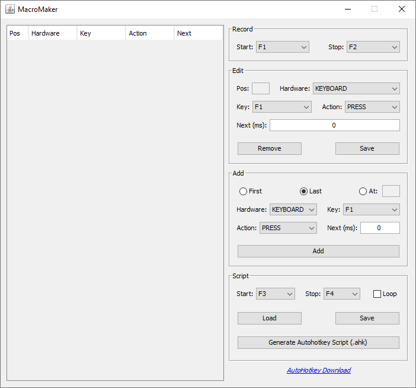
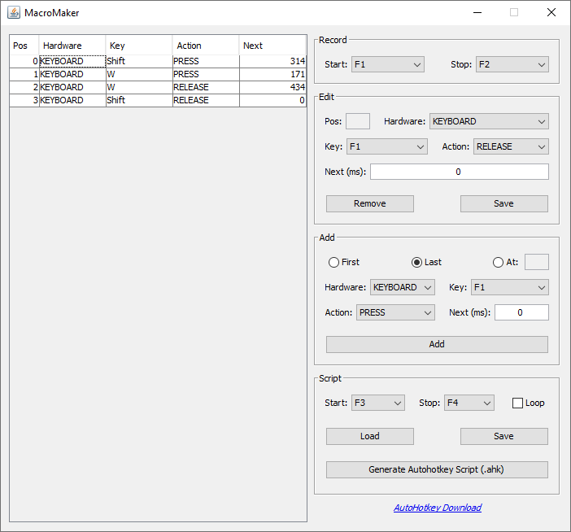
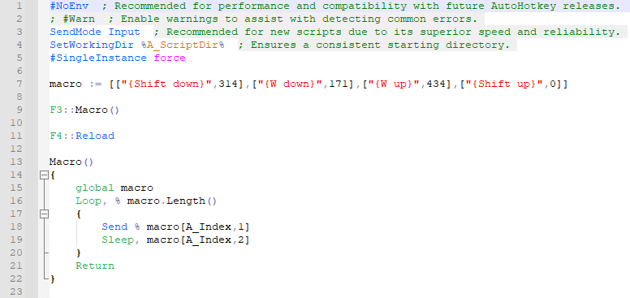

[Downloads](https://github.com/iagocolodetti/MacroMaker/blob/master/README.md#downloads "Downloads")
 
[Descrição](https://github.com/iagocolodetti/MacroMaker/blob/master/README.md#descri%C3%A7%C3%A3o "Descrição")
 
[Funcionamento](https://github.com/iagocolodetti/MacroMaker/blob/master/README.md#funcionamento "Funcionamento")
 
[Requisitos](https://github.com/iagocolodetti/MacroMaker/blob/master/README.md#requisitos "Requisitos")
 
[Projeto](https://github.com/iagocolodetti/MacroMaker/blob/master/README.md#projeto "Projeto")
 
 
# Downloads
https://github.com/iagocolodetti/MacroMaker/releases
* [MacroMaker.zip](https://github.com/iagocolodetti/MacroMaker/releases/download/v1.0/MacroMaker.zip "MacroMaker.zip")
* [Código-fonte](https://github.com/iagocolodetti/MacroMaker/archive/v1.0.zip "v1.0.zip")
# Descrição
Aplicação que captura cliques do teclado e mouse para automatizar o processo.
 
 

 
*Aplicação*
 
 
# Funcionamento
Ao iniciar uma gravação, cliques do teclado e mouse são registrados e ao parar a gravação, será possível gerar um script AutoHotkey que fará com que o processo seja repetido com apenas um clique.
 
Também é possível editar/remover o que já foi capturado ou adicionar manualmente, além da opção de salvar/carregar gravações para futuras edições.
 
 

 
*Exemplo - Aplicação após a gravação*
 
 

 
*Exemplo - Script AutoHotkey gerado*
 
 
# Requisitos
Uso/instalação do [Java Runtime Environment (JRE)](https://www.java.com/pt_BR/download) e [AutoHotkey](https://www.autohotkey.com).
 
E também atender aos [requisitos do JNativeHook](https://github.com/kwhat/jnativehook#software-and-hardware-requirements).
 
 
# Projeto
Desenvolvido no NetBeans IDE 8.2 usando a linguagem Java e a biblioteca [JNativeHook](https://github.com/kwhat/jnativehook).
